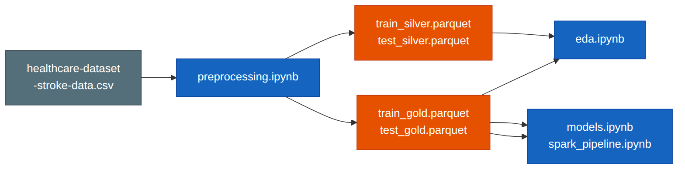
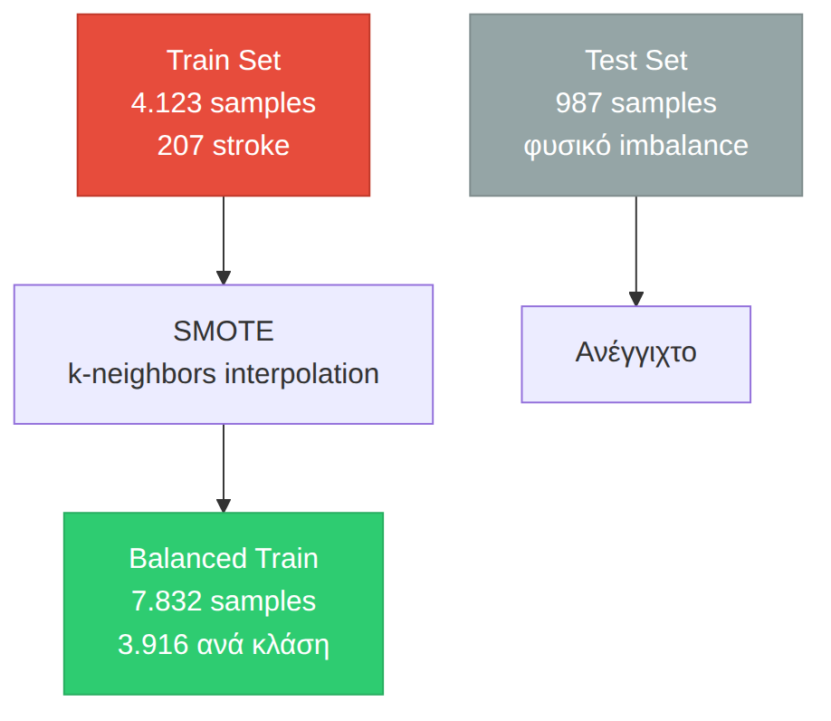
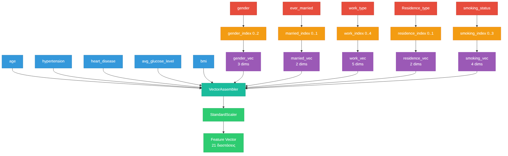
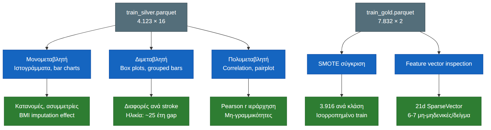
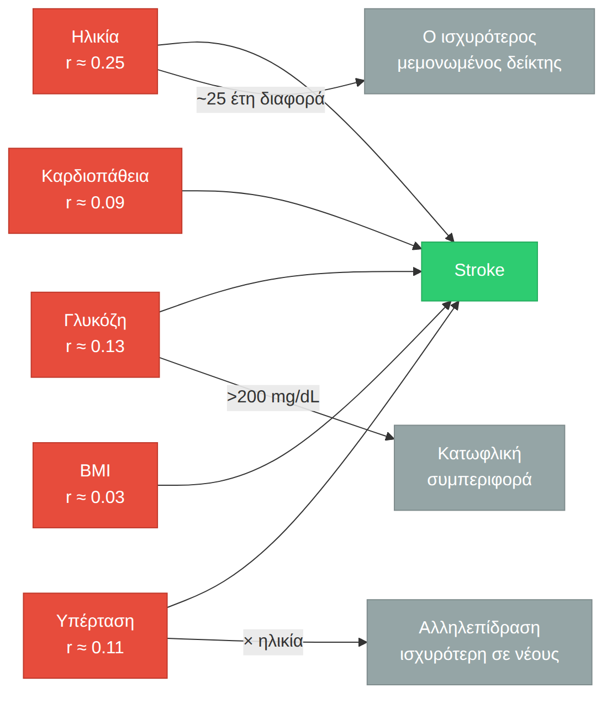

# Τεκμηρίωση Έργου: Stroke Prediction

---

## 1. Εισαγωγή

Το εγκεφαλικό επεισόδιο (stroke) είναι μία από τις κύριες αιτίες θανάτου και αναπηρίας παγκοσμίως, σύμφωνα με τον Παγκόσμιο Οργανισμό Υγείας. 1 στα 4 άτομα θα υποστεί εγκεφαλικό στη ζωή του. Ο έγκαιρος εντοπισμός παραγόντων κινδύνου μπορεί να βοηθήσει στην πρόληψη.

Χρησιμοποιούμε 5.110 ιατρικές εγγραφές για να εκπαιδεύσουμε μοντέλα που προβλέπουν την πιθανότητα εγκεφαλικού. Είναι κλασικό πρόβλημα **δυαδικής ταξινόμησης** με βαριά ανισορροπία κλάσεων: μόλις το 5% των ασθενών έχει υποστεί εγκεφαλικό.

Τα δεδομένα περνούν από τρία στάδια — Bronze → Silver → Gold: καθαρισμός, κωδικοποίηση, κανονικοποίηση. Μετά τροφοδοτούν τους αλγορίθμους.

---

## 2. Το Dataset

### 2.1 Χαρακτηριστικά

| Μεταβλητή | Τύπος | Περιγραφή |
|-----------|-------|-----------|
| `gender` | Ονομαστική | Φύλο (Male, Female, Other) |
| `age` | Συνεχής | Ηλικία |
| `hypertension` | Δυαδική | Ιστορικό υπέρτασης (0/1) |
| `heart_disease` | Δυαδική | Ιστορικό καρδιοπάθειας (0/1) |
| `ever_married` | Δυαδική | Οικογενειακή κατάσταση (Yes/No) |
| `work_type` | Ονομαστική | Τύπος εργασίας (5 κατηγορίες) |
| `Residence_type` | Δυαδική | Περιοχή κατοικίας (Urban/Rural) |
| `avg_glucose_level` | Συνεχής | Μέσο επίπεδο γλυκόζης |
| `bmi` | Συνεχής | Δείκτης Μάζας Σώματος |
| `smoking_status` | Ονομαστική | Καπνιστική συνήθεια (4 κατηγορίες) |
| `stroke` | Δυαδική | **Μεταβλητή-στόχος** |

### 2.2 Προκλήσεις

**Ανισορροπία κλάσεων.** Η κλάση stroke=1 είναι περίπου το 5% του συνόλου. Χωρίς διόρθωση, ένα μοντέλο που προβλέπει πάντα «όχι stroke» θα πετύχαινε accuracy 95%, αλλά θα ήταν κλινικά άχρηστο (μηδενικό recall για τη θετική κλάση).

**Ελλιπείς τιμές.** Η στήλη `bmi` έχει 201 εγγραφές με την τιμή `"N/A"` (string, όχι null). Χρειάζεται ρητή μετατροπή και imputation.

**Κατηγορικές μεταβλητές.** Οι 5 από τις 10 προγνωστικές μεταβλητές είναι κατηγορικές. Χρειάζονται encoding που δεν εισάγει πλασματική διάταξη (ordinal bias).

---

## 3. Αρχιτεκτονική Δεδομένων

### 3.1 Το Μοτίβο Bronze → Silver → Gold

Το pipeline έχει τρία στάδια. Κάθε ένα παίρνει την έξοδο του προηγούμενου και την προχωράει ένα βήμα παρακάτω:


| Στάδιο | Τι συμβαίνει | Αποτέλεσμα |
|--------|-------------|------------|
| **Bronze** | Φόρτωση CSV, αφαίρεση `id`, μετατροπή `N/A` → `null` | 5.110 γραμμές × 11 στήλες |
| **Silver** | Train/test split (πρώτα), μετά median imputation, StringIndexer, διατήρηση original labels | Train 4.123 / Test 987 × 16 στήλες |
| **Gold** | OneHotEncoder, VectorAssembler, StandardScaler, SMOTE | Train 7.832 / Test 987, SparseVector 21d |

### 3.2 Ροή Δεδομένων μεταξύ Notebooks




Το **preprocessing** είναι ο μοναδικός παραγωγός δεδομένων. Το EDA διαβάζει Silver (readable labels) και Gold (feature vector inspection). Τα μοντέλα διαβάζουν μόνο Gold.

---

## 4. Data Preprocessing

### 4.1 Θεωρητικό Υπόβαθρο

Η προεπεξεργασία καθορίζει σε μεγάλο βαθμό την ποιότητα των μοντέλων. Τα λάθη εδώ δεν διορθώνονται εύκολα μετά.

#### Data Leakage

Το data leakage είναι από τα πιο ύπουλα λάθη. Συμβαίνει όταν πληροφορία από το test set διαρρέει στο training, συνήθως επειδή υπολογίζεις στατιστικά (μέσο όρο, διάμεσο, τυπική απόκλιση) σε ολόκληρο το dataset πριν το split. Το αποτέλεσμα: υπεραισιόδοξες μετρικές που δεν ανταποκρίνονται στην πραγματικότητα.

Ο διαχωρισμός train/test γίνεται **πριν** από οποιονδήποτε μετασχηματισμό. Οι παράμετροι (median για imputation, categories για encoding, std για scaling) υπολογίζονται από το train και εφαρμόζονται στο test χωρίς επανυπολογισμό. Το test set παραμένει ανέγγιχτο καθ' όλη τη διάρκεια του training.

#### Imputation

Σε πραγματικές μετρήσεις, οι ελλιπείς τιμές είναι δεδομένες. Το θέμα είναι ποια στρατηγική θα διαλέξεις:

- **Mean.** Απλή αλλά ευαίσθητη σε outliers. Μία ακραία τιμή τραβάει τον μέσο όρο.
- **Median.** Ανθεκτική σε outliers. Διατηρεί την κεντρική τάση χωρίς να επηρεάζεται από τις άκρες.
- **Mode.** Για κατηγορικές μεταβλητές.

Για το BMI, που μπορεί να έχει ακραίες τιμές, η διάμεσος είναι η σωστή επιλογή.

#### Ordinal Bias

Αν κωδικοποιήσεις κατηγορικές μεταβλητές ως αριθμητικούς δείκτες (Female=0, Male=1, Other=2), οι αλγόριθμοι μπορεί να ερμηνεύσουν λάθος τη διάταξη. Δεν υπάρχει μαθηματική σχέση διάταξης μεταξύ φύλων, το "Male" δεν είναι «μεγαλύτερο» από το "Female".

Η λύση είναι το one-hot encoding. Κάθε κατηγορία γίνεται ανεξάρτητη δυαδική στήλη, χωρίς υπονοούμενη διάταξη.

### 4.2 Υλοποίηση

Το `preprocessing.ipynb` εκτελεί όλα τα βήματα με τη σειρά. Το notebook δεν παράγει γραφήματα — όλες οι οπτικοποιήσεις είναι στο EDA.

| Βήμα | Τι συμβαίνει | Τεχνική λεπτομέρεια |
|------|-------------|-------------------|
| Bronze | Φόρτωση, αφαίρεση `id` | Το `id` είναι surrogate key, δεν έχει προγνωστική αξία |
| Καθαρισμός BMI | `"N/A"` → null → Double | 201 κενά (3.9%), ρητή μετατροπή τύπου |
| Train/Test Split | `randomSplit(0.8, 0.2)` | seed=42 για αναπαραγωγιμότητα |
| Imputation | Median, μόνο στο train | Παράμετρος μεταφέρεται στο test χωρίς refit |
| StringIndexer | Κατηγορικές → αριθμητικοί δείκτες | Τα original strings διατηρούνται για το EDA |
| SMOTE | Συνθετικά δείγματα μειοψηφικής κλάσης | Μόνο στο train (μετά την αποθήκευση Silver), rounding + clipping |
| OneHotEncoder | Δείκτες → δυαδικές στήλες | 21 διαστάσεις: 5 αριθμητικές + 16 δυαδικές |
| StandardScaler | Διαίρεση με τυπική απόκλιση | withMean=False (sparse vectors) |

### 4.3 SMOTE, Τεχνική Ανάλυση

Το SMOTE (Synthetic Minority Oversampling Technique) δημιουργεί συνθετικά δείγματα με παρεμβολή στον χώρο των χαρακτηριστικών. Για κάθε δείγμα της μειοψηφικής κλάσης:

1. Επιλέγεται ένας από τους k-κοντινότερους γείτονες (από την ίδια κλάση)
2. Δημιουργείται νέο σημείο τυχαία στην ευθεία που ενώνει το αρχικό δείγμα με τον γείτονα

Η παρεμβολή παράγει **δεκαδικές τιμές** ακόμα και για δυαδικές ή ακέραιες μεταβλητές. Για τους δείκτες κατηγοριών αυτό δεν έχει νόημα. Ο δείκτης φύλου 1.3 στρογγυλοποιείται σε 1 και κλειδώνεται εντός των έγκυρων ορίων (0 έως max_index).




---

## 5. Feature Engineering

### 5.1 Κατασκευή του Feature Vector

Το τελικό feature vector είναι η συνένωση όλων των επεξεργασμένων χαρακτηριστικών:




Διάσταση: 5 (αριθμητικές) + 3 + 2 + 5 + 2 + 4 (one-hot) = **21 διαστάσεις**

### 5.2 Sparsity

Λόγω του one-hot encoding, τα feature vectors είναι αραιά (sparse). Από τις 21 διαστάσεις, μόνο 6-7 είναι μη-μηδενικές ανά δείγμα. Ακριβώς μία ενεργή στήλη ανά κατηγορική μεταβλητή, συν τις 5 αριθμητικές μετά την κανονικοποίηση.

Αυτό επηρεάζει την επιλογή αλγορίθμων. Τα γραμμικά μοντέλα (λογιστική παλινδρόμηση, SVM) επωφελούνται από sparse αναπαραστάσεις. Τα δέντρα απόφασης, όχι τόσο.

---

## 6. Exploratory Data Analysis

### 6.1 Μεθοδολογία

Η διερευνητική ανάλυση δεδομένων (EDA) εξετάζει τη δομή, τις κατανομές και τις συσχετίσεις των μεταβλητών. Το `eda.ipynb` φορτώνει δεδομένα από το **Silver Layer**, την ενδιάμεση κατάσταση όπου οι μεταβλητές είναι καθαρές και κωδικοποιημένες αλλά διατηρούν τα ονόματά τους, όχι αριθμημένα vectors.

### 6.2 Ανάλυση ανά Τύπο Μεταβλητής

| Τύπος ανάλυσης | Περιγραφή | Στατιστική βάση |
|---------------|-----------|----------------|
| Μονομεταβλητή (univariate) | Ιστογράμματα, bar charts για κάθε μεταβλητή | Κατανομή συχνοτήτων, κεντρική τάση (mean/median) |
| Διμεταβλητή (bivariate) | Συγκρίσεις ανά κλάση stroke | Διαφορές κατανομών, conditional distributions |
| Πολυμεταβλητή (multivariate) | Correlation matrix, pairplot | Γραμμικές συσχετίσεις (Pearson r), οπτικές σχέσεις |

### 6.3 Οπτικοποιήσεις

Το notebook παράγει **10 γραφήματα** με matplotlib/seaborn. Καμία οπτικοποίηση δεν επαναλαμβάνεται από το preprocessing (που έχει μηδέν plots).

| Γράφημα | Τι δείχνει | Insight |
|---------|-----------|---------|
| Train/Test split | Μέγεθος συνόλων + class dist | 80/20 αναλογία, 5% stroke |
| Ιστογράμματα | Κατανομές age, glucose, bmi | Ασυμμετρία, outliers, imputation effect |
| Box plots | Κατανομές ανά stroke | Διαφορές IQR, outliers ανά κλάση |
| Bar charts | Συχνότητες κατηγορικών | Ανισορροπία σε φύλο, εργασία, κάπνισμα |
| Grouped bars | % stroke ανά κατηγορία | Παράγοντες κινδύνου |
| Density age | Πυκνότητα ηλικίας ανά stroke | ~25 έτη διαφορά μέσων τιμών |
| Correlation heatmap | Συντελεστές Pearson | Ιεράρχηση προγνωστικών παραγόντων |
| Pairplot | Σχέσεις age, glucose, bmi | Μη-γραμμικότητες, clusters |
| BMI analysis | Πυκνότητα + box ανά stroke | Μερική επικάλυψη, μικρή μετατόπιση |
| Gold Layer | SMOTE σύγκριση + feature vector | Sparsity, διαστάσεις |

### 6.4 Ροή Ανάλυσης




### 6.5 Ιεράρχηση Προγνωστικών Παραγόντων




---

## 7. Data Layer Architecture

### 7.1 Silver Layer

Το Silver Layer είναι η ενδιάμεση κατάσταση. Τα δεδομένα είναι καθαρά, indexed, με imputed BMI, αλλά **πριν** το oversampling και το one-hot encoding. Κρατάμε επίτηδες τις original string στήλες για να μπορεί το EDA να παράγει readable οπτικοποιήσεις:

| Στήλη | Τύπος | Προέλευση |
|-------|-------|-----------|
| `gender`, `ever_married`, `work_type`, `Residence_type`, `smoking_status` | string | Original |
| `gender_index`, `ever_married_index`, `work_type_index`, `Residence_type_index`, `smoking_status_index` | double | StringIndexer |
| `age`, `hypertension`, `heart_disease`, `avg_glucose_level`, `bmi` | double/int | Original (bmi imputed) |
| `stroke` | int | Label |

16 στήλες συνολικά. Το EDA τις φορτώνει από εδώ.

### 7.2 Gold Layer

Το Gold Layer είναι το τελικό στάδιο. Έχει μόνο δύο στήλες:

| Στήλη | Τύπος | Περιγραφή |
|-------|-------|-----------|
| `features` | SparseVector (21) | Κανονικοποιημένο feature vector |
| `stroke` | int | Label |

**Train:** 7.832 δείγματα, ισορροπημένο (SMOTE)
**Test:** 987 δείγματα, φυσική κατανομή

Τα μοντέλα (`models.ipynb`, `spark_pipeline.ipynb`) φορτώνουν από εδώ.

---

## 8. Ευρήματα & Συμπεράσματα

### 8.1 Ιεράρχηση Προγνωστικών Παραγόντων

| Παράγοντας | Συσχέτιση με stroke | Σχόλιο |
|-----------|-------------------|--------|
| Ηλικία | Πολύ ισχυρή (r ≈ 0.25) | Διαφορά ~25 έτη μεταξύ κλάσεων |
| avg_glucose_level | Μέτρια (r ≈ 0.13) | Τιμές >200 σχεδόν αποκλειστικά σε stroke |
| hypertension | Μέτρια (r ≈ 0.11) | Δυαδική, σαφής παράγοντας |
| heart_disease | Ασθενής (r ≈ 0.09) | Δυαδική, λιγότερο συχνή |
| BMI | Πολύ ασθενής (r ≈ 0.03) | Από μόνο του δεν διαχωρίζει |

### 8.2 Μη-Γραμμικές Σχέσεις

- **Κάπνισμα.** Οι πρώην καπνιστές έχουν υψηλότερο ποσοστό stroke από τους νυν. Αυτό είναι μη γραμμική σχέση και τα γραμμικά μοντέλα δυσκολεύονται να τη συλλάβουν.
- **Ηλικία × υπέρταση.** Υπάρχει αλληλεπίδραση. Η υπέρταση σε νεότερες ηλικίες είναι ισχυρότερος δείκτης κινδύνου από ό,τι σε μεγαλύτερες.
- **Γλυκόζη.** Κατωφλική συμπεριφορά. Τιμές άνω των 200 mg/dL είναι σχεδόν παθογνωμονικές για stroke.

### 8.3 Συνέπειες για τη Μοντελοποίηση

- Το **class imbalance** έχει αντιμετωπιστεί με SMOTE στο Gold Layer, αλλά η αξιολόγηση πρέπει να γίνει στο ανέγγιχτο test set.
- Οι **μη-γραμμικές σχέσεις** δείχνουν ότι δέντρα απόφασης και ensemble μέθοδοι (Random Forest, Gradient Boosting) πιθανώς θα υπερτερούν των γραμμικών μοντέλων.
- Η **sparsity** του feature vector ευνοεί γραμμικά μοντέλα (Logistic Regression), που λειτουργούν ως baseline.
- Το **SMOTE** έχει δημιουργήσει ισορροπημένο train. Το test παραμένει ανέγγιχτο για ρεαλιστική αξιολόγηση.

---

## 9. Τεχνικές Αποφάσεις & Trade-offs

| Απόφαση | Εναλλακτική | Αιτιολόγηση |
|---------|------------|------------|
| Median imputation | Mean imputation | Ανθεκτικότητα σε outliers του BMI |
| SMOTE | Random undersampling | Διατηρούμε όλα τα δεδομένα της πλειοψηφικής κλάσης |
| OneHotEncoder | LabelEncoder | Αποφυγή ordinal bias |
| StandardScaler (withMean=False) | MinMaxScaler | Διατήρηση sparsity (το mean subtraction σκοτώνει τα μηδενικά) |
| Parquet format | CSV | Συμπίεση, columnar, schema preservation |
| Silver Layer save | Μόνο Gold | Readable EDA χωρίς raw CSV |

---

## 10. Επόμενα Βήματα

### 10.1 `models.ipynb`, Εκπαίδευση Μοντέλων

Θα εκπαιδεύσουμε δύο ταξινομητές πάνω στο Gold Layer. Και οι δύο πρέπει να δουλέψουν με το class imbalance, είτε μέσω weighted loss είτε μέσω threshold tuning.

| Ταξινομητής | Γιατί |
|-------------|-------|
| **MLP (Multi-Layer Perceptron)** | Πιάνει μη-γραμμικά όρια απόφασης. Είναι ευαίσθητο στην κλίμακα, γι' αυτό έχουμε StandardScaler. Χρειάζεται προσεκτική ρύθμιση learning rate. |
| **SVM (Linear SVC)** | Αποδοτικό σε sparse δεδομένα, το Gold είναι SparseVector 21d. Γραμμικό baseline για σύγκριση με το MLP. |

Διαδικασία: 5-fold cross-validation (stratified), grid search για learning rate, hidden layers (MLP) και regularization (SVM). Εναλλακτικά, class weights αντί για threshold tuning για το imbalance. Η έξοδος πάει στο evaluation notebook.

### 10.2 `spark_pipeline.ipynb`, Spark ML Pipeline

Εδώ όλο το pipeline τρέχει μέσα στο PySpark ML. Σε αντίθεση με το preprocessing όπου το SMOTE έγινε εκτός Spark (imbalanced-learn + Pandas), εδώ τα δεδομένα δεν φεύγουν ποτέ από το Spark DataFrame.

Το pipeline:

```
Imputer → StringIndexer → OneHotEncoder → VectorAssembler → StandardScaler → Classifier
```

| Ταξινομητής | Spark class | Γιατί |
|-------------|-------------|-------|
| **Random Forest** | `RandomForestClassifier` | 100+ δέντρα, ανθεκτικό σε overfitting, ενσωματωμένο feature importance |
| **Logistic Regression** | `LogisticRegression` | Γραμμικό baseline, γρήγορο, `weightCol` για class imbalance |

### 10.3 `advanced_technique.ipynb`, Προχωρημένη Τεχνική

Δύο κατευθύνσεις, θα διαλέξουμε μία:

**Association Rules (FP-Growth).** Ψάχνουμε κανόνες της μορφής `{age > 60, hypertension=1} → {stroke=1}` με υψηλό confidence. Χρειάζεται διακριτοποίηση συνεχών μεταβλητών (age bins, glucose bins) και binarization κατηγορικών. Θα κυνηγήσουμε κανόνες με lift > 1.

**Clustering (K-Means / Bisecting K-Means).** Ομαδοποίηση ασθενών χωρίς επίβλεψη. Μετά βλέπουμε αν τα clusters ευθυγραμμίζονται με το stroke label. Silhouette score για βέλτιστο k, adjusted Rand index για σύγκριση με ground truth.

### 10.4 `evaluation.ipynb`, Αξιολόγηση και Σύγκριση

Η αξιολόγηση γίνεται αποκλειστικά στο test set (987 δείγματα, φυσικό imbalance ~5%). Το test δεν το έχει δει κανένα μοντέλο.

Οι μετρικές που θα κοιτάξουμε:

- **Accuracy.** Παραπλανητική λόγω imbalance. Ένα dummy «πάντα όχι» μοντέλο βγάζει 95%.
- **Precision / Recall.** Το recall είναι κλινικά σημαντικό. Τα false negatives (αδιάγνωστα stroke) έχουν σοβαρές συνέπειες.
- **F1-Score.** Αρμονικός μέσος precision-recall. Ισορροπεί ψευδείς συναγερμούς με χαμένα περιστατικά.
- **ROC-AUC.** Διαχωριστική ικανότητα ανεξάρτητα από το threshold.
- **Confusion Matrix.** TP/FP/FN/TN, λεπτομερής κατανομή σφαλμάτων.

Οπτικοποιήσεις: confusion matrix heatmap, ROC curves όλων των μοντέλων στο ίδιο διάγραμμα, bar charts για precision/recall/F1/AUC, και ένας συνοπτικός συγκριτικός πίνακας.

Θα κοιτάξουμε επίσης χρόνους εκπαίδευσης, ερμηνευσιμότητα (feature importance από Random Forest vs black-box MLP), και ευρωστία σε πολλαπλά runs.

### 10.5 Παρουσίαση

10–15 λεπτά. Θα δείξουμε το πρόβλημα, το dataset, την αρχιτεκτονική Bronze → Silver → Gold, τα κύρια ευρήματα του EDA, και τη σύγκριση των μοντέλων με τελική σύσταση. Θα πούμε και τι μας δυσκόλεψε και τι θα αλλάζαμε.

---

## 11. Τελικές Σημειώσεις

Αυτό το έγγραφο καταγράφει τι κάναμε και γιατί — από το καθάρισμα των δεδομένων μέχρι την επιλογή των μοντέλων. Τα notebooks υλοποιούν τα βήματα που περιγράφονται εδώ. Η σειρά εκτέλεσης και οι συμβάσεις του project είναι στο `AGENTS.md`.
