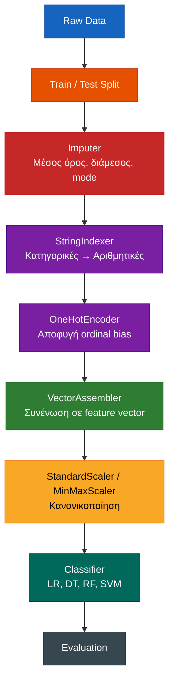
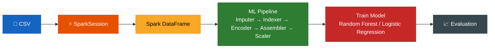
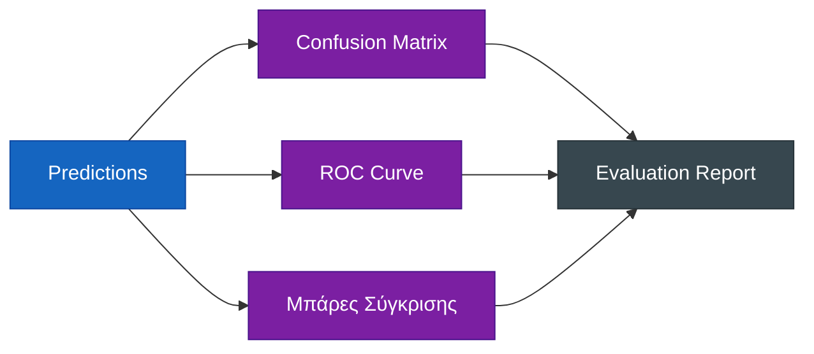

# 🧠 Big Data & Data Mining — Stroke Prediction

> **Εξαμηνιαία Εργασία** στο μάθημα *Big Data & Data Mining*  
> **Dataset:** [Stroke Prediction Dataset](https://www.kaggle.com/datasets/fedesoriano/stroke-prediction-dataset/data) από το Kaggle

---

## 👥 Ομάδα & Ρόλοι

| Ρόλος | Μέλος | Αρμοδιότητες |
|-------|-------|---------------|
| **Data Engineer** | `[Ονοματεπώνυμο]` | Preprocessing, pipelines, Spark, data cleaning |
| **Data Analyst** | `[Ονοματεπώνυμο]` | EDA, visualizations, insights, στατιστικά |
| **ML Engineer** | `[Ονοματεπώνυμο]` | Μοντέλα classification, evaluation, σύγκριση |

> ⚠️ **Σημαντικό:** Οι φάσεις εκτελούνται **σειριακά**, όχι παράλληλα. Κάθε φάση πρέπει να ολοκληρώνεται πριν ξεκινήσει η επόμενη.

---

## 📊 Το Dataset

| Ιδιότητα | Τιμή |
|----------|------|
| **Όνομα** | Healthcare Dataset — Stroke Prediction |
| **Πηγή** | [Kaggle](https://www.kaggle.com/datasets/fedesoriano/stroke-prediction-dataset/data) |
| **Μέγεθος** | 5.110 εγγραφές, 12 στήλες |
| **Target** | `stroke` (0 = όχι εγκεφαλικό, 1 = εγκεφαλικό) |

### Στήλες

| Στήλη | Τύπος | Περιγραφή |
|-------|-------|-----------|
| `id` | integer | Μοναδικό αναγνωριστικό |
| `gender` | categorical | Φύλο (Male, Female, Other) |
| `age` | numeric | Ηλικία |
| `hypertension` | binary | Υπέρταση (0/1) |
| `heart_disease` | binary | Καρδιοπάθεια (0/1) |
| `ever_married` | binary | Έγγαμος/η (Yes/No) |
| `work_type` | categorical | Τύπος εργασίας (5 κατηγορίες) |
| `Residence_type` | binary | Urban / Rural |
| `avg_glucose_level` | numeric | Μέσο επίπεδο γλυκόζης |
| `bmi` | numeric | Δείκτης Μάζας Σώματος (**περιέχει N/A**) |
| `smoking_status` | categorical | Καπνιστική συνήθεια (4 κατηγορίες) |
| `stroke` | binary | 🎯 **Target** (0 ή 1) |

### Προβλήματα προς αντιμετώπιση

- **Missing values:** Η στήλη `bmi` περιέχει `N/A` που χρειάζονται imputation
- **Class imbalance:** Το `stroke=1` είναι πολύ σπάνιο σε σχέση με το `stroke=0`
- **Categorical encoding:** 5 κατηγορικές στήλες χρειάζονται encoding

---

## 🛠 Τεχνολογίες & Εργαλεία

| Εργαλείο | Χρήση |
|----------|-------|
| **Python 3.x** | Γλώσσα υλοποίησης |
| **Jupyter Notebook** | Ανάπτυξη & documentation |
| **Pandas / NumPy** | Data manipulation |
| **Matplotlib / Seaborn** | Visualizations (EDA) |
| **Scikit-learn** | Classification models & evaluation |
| **PySpark** | Big Data processing (bonus) |
| **Git / GitHub** | Version control & παράδοση |

---

## 🔄 Συνολικό Workflow


---

## ⚙️ Spark ML Pipeline (από το Doc.htm)



### Επεξήγηση σταδίων

| Στάδιο | Ρόλος | Λεπτομέρειες |
|--------|-------|--------------|
| **Imputer** | Γεμίζει missing values | Mean (συνεχείς), Median (ανθεκτικό σε outliers), Mode (κατηγορικές) |
| **StringIndexer** | Μετατροπή κατηγορικών σε αριθμητικές | Π.χ. `Male` → 0, `Female` → 1 |
| **OneHotEncoder** | Αποφυγή ordinal bias | Δημιουργεί binary columns για κάθε κατηγορία |
| **VectorAssembler** | Συνένωση στηλών | Όλα τα features σε ένα vector |
| **Scaler** | Κανονικοποίηση | StandardScaler (κανονική κατανομή) ή MinMaxScaler (εύρος) |
| **Classifier** | Τελικό μοντέλο | Logistic Regression, Decision Tree, Random Forest, Linear SVC |
---

## 📋 Αναλυτικές Φάσεις

### Φάση Α: Data Preprocessing
> **Υπεύθυνος:** Data Engineer | **Εκτιμώμενος χρόνος:** 5 ημέρες

**Στόχος:** Καθαρό, έτοιμο dataset για EDA και modeling.

**Βήματα:**

1. **Φόρτωση δεδομένων**
   ```python
   import pandas as pd
   df = pd.read_csv("healthcare-dataset-stroke-data.csv")
   ```

2. **Καθαρισμός δεδομένων**
   - Εντοπισμός & αντικατάσταση `N/A` στη στήλη `bmi` (mean/median imputation)
   - Έλεγχος για duplicates
   - Αφαίρεση άχρηστων στηλών (π.χ. `id` για το modeling)
   - Χειρισμός της κατηγορίας `Unknown` στο `smoking_status`

3. **Feature Engineering**
   - Encoding κατηγορικών μεταβλητών (One-Hot / Label Encoding)
   - Δημιουργία νέων features (π.χ. age groups, BMI categories)
   - Train/test split (70/30 ή 80/20)

4. **Handling Class Imbalance**
   - SMOTE ή RandomUnderSampling για το target `stroke`

**Παραδοτέα φάσης:**
- `preprocessing.ipynb` – Notebook με όλα τα βήματα
- `cleaned_data.csv` – Το επεξεργασμένο dataset

---

### Φάση Β: Exploratory Data Analysis
> **Υπεύθυνος:** Data Analyst | **Εκτιμώμενος χρόνος:** 4 ημέρες

**Στόχος:** Κατανόηση των δεδομένων μέσω οπτικοποίησης και στατιστικής.

**Βήματα:**

1. **Στατιστική ανάλυση**
   - `df.describe()` – Βασικά στατιστικά
   - `df.info()` – Τύποι δεδομένων, missing values
   - Κατανομή target variable (`stroke`)

2. **Visualizations**
   - **Κατανομή** στόχου: bar plot (class imbalance)
   - **Κατηγορικές στήλες:** count plots (`gender`, `work_type`, `smoking_status`)
   - **Αριθμητικές στήλες:** histograms & box plots (`age`, `bmi`, `avg_glucose_level`)
   - **Συσχετίσεις:** heatmap correlation matrix
   - **Pairplots:** Σχέσεις μεταξύ αριθμητικών μεταβλητών
   - **Stroke vs features:** Κατανομές ανά target class

3. **Insights**
   - Ποια features συσχετίζονται περισσότερο με το stroke;
   - Υπάρχουν outliers;
   - Ποιο είναι το προφίλ ασθενούς υψηλού κινδύνου;

**Παραδοτέα φάσης:**
- `eda.ipynb` – Notebook με όλα τα γραφήματα και σχόλια

---

### Φάση Γ: Classification Models
> **Υπεύθυνος:** ML Engineer | **Εκτιμώμενος χρόνος:** 5 ημέρες

**Στόχος:** Υλοποίηση 2 classification μοντέλων.

**Προτεινόμενα μοντέλα:**

| # | Μοντέλο | Βιβλιοθήκη |
|---|---------|-------------|
| 1 | **Neural Network (MLP)** | `sklearn.neural_network.MLPClassifier` |
| 2 | **SVM** | `sklearn.svm.SVC` |

**Εναλλακτικά μοντέλα:** Decision Trees, Naive Bayes, Random Forest

**Βήματα:**

1. **Εκπαίδευση Μοντέλου 1 (MLP)**
   - Ορισμός architecture (hidden layers, activation)
   - Training με cross-validation
   - Πρόβλεψη στο test set

2. **Εκπαίδευση Μοντέλου 2 (SVM)**
   - Επιλογή kernel (RBF, linear)
   - Grid Search για hyperparameter tuning
   - Πρόβλεψη στο test set

3. **Αρχικές προβλέψεις & validation**
   - Αποθήκευση predictions
   - Έλεγχος overfitting

**Παραδοτέα φάσης:**
- `models.ipynb` – Notebook με εκπαίδευση και προβλέψεις
- `trained_models/` – Αποθηκευμένα μοντέλα (`.pkl` ή `.joblib`)

---

### Φάση Δ: Big Data & Advanced Technique
> **Συμμετέχουν όλοι — συντονίζει ο Data Engineer** | **Εκτιμώμενος χρόνος:** 4 ημέρες

**Στόχοι:**

#### 4.1 Advanced Technique (υποχρεωτικό)

Επιλογή **1** από:
- **Association Rules** (Apriori / FP-Growth) για εύρεση συσχετίσεων μεταξύ risk factors
- **Clustering (K-Means)** για ομαδοποίηση ασθενών σε προφίλ κινδύνου

#### 4.2 Big Data Approach με Spark (bonus)



**Υλοποίηση Spark ML Pipeline:**

```python
from pyspark.sql import SparkSession
from pyspark.ml import Pipeline
from pyspark.ml.feature import StringIndexer, OneHotEncoder, VectorAssembler, Imputer, StandardScaler
from pyspark.ml.classification import RandomForestClassifier

spark = SparkSession.builder.appName("StrokePrediction").getOrCreate()
df = spark.read.csv("healthcare-dataset-stroke-data.csv", header=True, inferSchema=True)

# 1. Imputer
imputer = Imputer(inputCols=["bmi"], outputCols=["bmi_imputed"], strategy="mean")

# 2. StringIndexer
gender_indexer = StringIndexer(inputCol="gender", outputCol="gender_idx")

# 3. OneHotEncoder
encoder = OneHotEncoder(inputCols=["gender_idx", "work_type_idx"], 
                         outputCols=["gender_vec", "work_type_vec"])

# 4. VectorAssembler
assembler = VectorAssembler(inputCols=["age", "bmi_imputed", ...], outputCol="features")

# 5. Scaler
scaler = StandardScaler(inputCol="features", outputCol="scaled_features")

# 6. Classifier
rf = RandomForestClassifier(featuresCol="scaled_features", labelCol="stroke")

# Pipeline
pipeline = Pipeline(stages=[imputer, indexer, encoder, assembler, scaler, rf])
model = pipeline.fit(train_df)
predictions = model.transform(test_df)
```

**Παραδοτέα φάσης:**
- `spark_pipeline.ipynb` – Spark implementation
- `advanced_technique.ipynb` – Association Rules ή Clustering

---

### Φάση Ε: Model Evaluation & Σύγκριση
> **Υπεύθυνος:** ML Engineer | **Εκτιμώμενος χρόνος:** 3 ημέρες

**Στόχος:** Αξιολόγηση όλων των μοντέλων και σύγκριση.

**Μετρικές:**

| Μετρική | Περιγραφή |
|---------|-----------|
| **Accuracy** | Συνολική ορθότητα |
| **Precision** | Πόσα από τα προβλεπόμενα strokes είναι όντως strokes |
| **Recall** | Πόσα από τα πραγματικά strokes εντοπίστηκαν |
| **F1-Score** | Αρμονικός μέσος Precision & Recall |
| **ROC-AUC** | Ικανότητα διάκρισης κλάσεων |

**Οπτικοποιήσεις:**



**Βήματα:**

1. **Υπολογισμός μετρικών** και για τα 2 classification μοντέλα
2. **Confusion Matrix** με heatmap (`seaborn.heatmap`)
3. **ROC Curve** (αν υποστηρίζεται από το μοντέλο)
4. **Συγκριτικός πίνακας** όλων των μετρικών
5. **Ανάλυση:** Ποιο μοντέλο αποδίδει καλύτερα και γιατί;

**Πίνακας σύγκρισης (παράδειγμα):**

| Μοντέλο | Accuracy | Precision | Recall | F1 | ROC-AUC |
|---------|----------|-----------|--------|-----|---------|
| MLP Neural Network | — | — | — | — | — |
| SVM | — | — | — | — | — |

**Παραδοτέα φάσης:**
- `evaluation.ipynb` – Notebook με όλες τις μετρικές και γραφήματα

---

### Φάση ΣΤ: Report & Παρουσίαση
> **Συμμετέχουν όλοι** | **Εκτιμώμενος χρόνος:** 6 ημέρες

**Παραδοτέα:**

| # | Παραδοτέο | Λεπτομέρειες | Μορφή |
|---|-----------|-------------|-------|
| 1 | **Report** | 10-15 σελίδες | Word / PDF |
| 2 | **Κώδικας** | Jupyter Notebooks | GitHub |
| 3 | **Παρουσίαση** | 10-15 λεπτά | PowerPoint |

**Δομή Report:**

1. Εισαγωγή — Στόχος, dataset, πρόβλημα
2. Μεθοδολογία — Pipeline, αλγόριθμοι, εργαλεία
3. Data Preprocessing — Βήματα, αποφάσεις
4. Exploratory Data Analysis — Γραφήματα, ευρήματα
5. Μοντέλα — Περιγραφή, υλοποίηση
6. Big Data — Spark pipeline
7. Evaluation — Μετρικές, σύγκριση
8. Συμπεράσματα — Insights, πρακτικές εφαρμογές

---

## 🚀 Οδηγίες Setup

### 1. Clone το repository

```bash
git clone https://github.com/Ma1cOS/Big-Data.git
cd Big-Data
```

### 2. Δημιουργία virtual environment

```bash
python -m venv venv
venv\Scripts\activate       # Windows
# source venv/bin/activate  # macOS/Linux
```

### 3. Εγκατάσταση dependencies

```bash
pip install -r requirements.txt
```

### 4. Εκκίνηση Jupyter

```bash
jupyter notebook
```

### 5. Σειρά εκτέλεσης notebooks

```
1. preprocessing.ipynb
2. eda.ipynb
3. models.ipynb
4. spark_pipeline.ipynb
5. advanced_technique.ipynb
6. evaluation.ipynb
```

---

## 📁 Δομή Project

```
Big-Data/
├── README.md                              # Αυτό το αρχείο
├── requirements.txt                       # Python dependencies
├── .gitignore                             # Git ignore rules
├── healthcare-dataset-stroke-data.csv     # Raw dataset
│
├── notebooks/
│   ├── preprocessing.ipynb                # Φάση Α: Καθαρισμός & feature engineering
│   ├── eda.ipynb                          # Φάση Β: Exploratory Data Analysis
│   ├── models.ipynb                       # Φάση Γ: Classification models
│   ├── spark_pipeline.ipynb               # Φάση Δ: Big Data με Spark
│   ├── advanced_technique.ipynb           # Φάση Δ: Association Rules / Clustering
│   └── evaluation.ipynb                   # Φάση Ε: Metrics & σύγκριση
│
├── data/
│   └── cleaned_data.csv                   # Επεξεργασμένο dataset (από Φάση Α)
│
├── models/
│   ├── mlp_model.pkl                      # Αποθηκευμένο MLP μοντέλο
│   └── svm_model.pkl                      # Αποθηκευμένο SVM μοντέλο
│
├── report/
│   └── BigData_Report.docx                # Τελικό report (10-15 σελίδες)
│
└── presentation/
    └── BigData_Presentation.pptx          # Παρουσίαση (10-15 λεπτά)
```

---

## 📊 Κριτήρια Αξιολόγησης

| Κριτήριο | Βαρύτητα |
|----------|----------|
| Data Preprocessing | 20% |
| Μοντέλα & Υλοποίηση | 30% |
| Evaluation & Σύγκριση | 20% |
| Report | 15% |
| Παρουσίαση | 15% |

---

## 📌 Σημειώσεις

- Η σειρά των φάσεων είναι **αυστηρά σειριακή** — η Φάση Β ξεκινά όταν ολοκληρωθεί η Α, κ.ο.κ.
- Όλα τα notebooks πρέπει να έχουν **σχόλια και Markdown cells** που εξηγούν τι γίνεται
- Το Spark section είναι **bonus** — υλοποιείται εφόσον υπάρχει χρόνος
- Το GitHub repository πρέπει να έχει **τακτικά commits** από όλα τα μέλη
- Στην παρουσίαση, κάθε μέλος παρουσιάζει το κομμάτι που υλοποίησε

---

> *"In God we trust. All others must bring data."* — W. Edwards Deming
