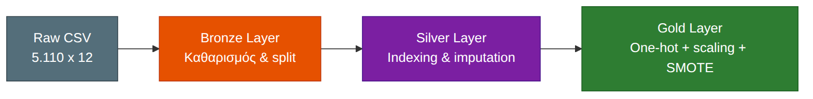
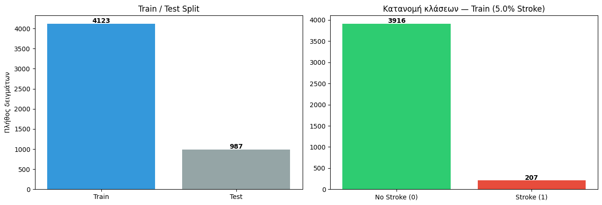
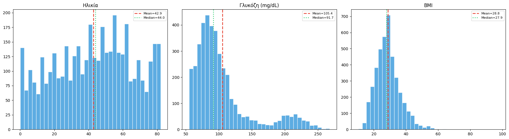
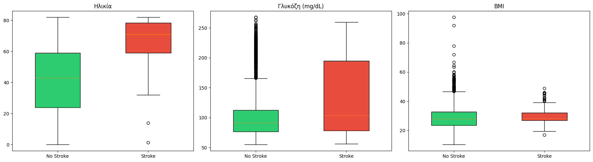
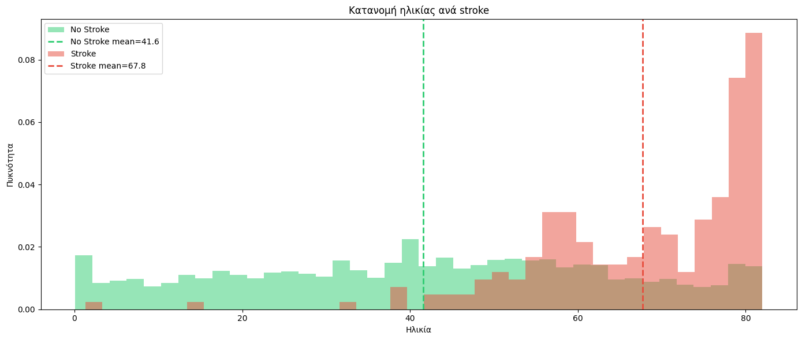
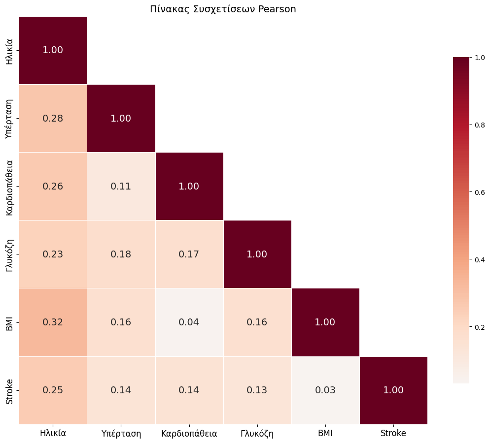
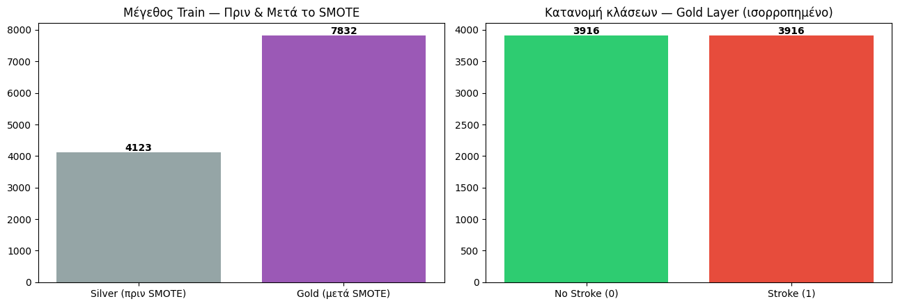

---

<!-- _paginate: false -->


# Παρουσίαση Εργασίας Εξαμήνου

## Πρόβλεψη Εγκεφαλικού Επεισοδίου

<div class="columns3" style="text-align:center; margin-top:36px;">
<div>Δημήτριος Παρασκευόπουλος<br>21390314</div>
<div>Σωτήρης Μάκο<br>20290136</div>
<div>Θωμάς Τραχίλης<br>22390225</div>
</div>

---

# Big Data & Data Mining, Stroke Prediction

- **Δεδομένα:** 5.110 ιατρικές εγγραφές ασθενών
- **Στόχος:** Δυαδική ταξινόμηση, πρόβλεψη πιθανότητας εγκεφαλικού
- **Πρόκληση:** Μόλις 5% των ασθενών έχει υποστεί stroke
- **Στοίβα:** PySpark ML, Python, Jupyter
- **Dataset:** [Kaggle — Stroke Prediction Dataset](https://www.kaggle.com/datasets/fedesoriano/stroke-prediction-dataset)
- **Repo:** [github.com/Ma1cOS/Big-Data](https://github.com/Ma1cOS/Big-Data)

---

<!-- _class: small lead -->
<div class="columns">
<div>

# Το Πρόβλημα & Το Dataset


**Το πρόβλημα:**
- Εγκεφαλικό: 1η αιτία αναπηρίας, 2η αιτία θανάτου
- **1 στα 4** άτομα θα υποστεί εγκεφαλικό (WHO)
- Binary classification: **stroke (1)** ή **όχι stroke (0)**

**Προκλήσεις:**
- Μόλις **5%** των ασθενών με stroke
- 201 BMI τιμές `"N/A"` (3.9%)
- 5/10 μεταβλητές κατηγορικές , ordinal bias

</div>
<div>

| Μεταβλητή | Τύπος |
|-----------|-------|
| `gender` | Κατηγορική |
| `age` | Αριθμητική |
| `hypertension` | Δυαδική |
| `heart_disease` | Δυαδική |
| `ever_married` | Κατηγορική |
| `work_type` | Κατηγορική (5) |
| `Residence_type` | Κατηγορική |
| `avg_glucose_level` | Αριθμητική |
| `bmi` | Αριθμητική |
| `smoking_status` | Κατηγορική (4) |
| `stroke` | **Label** (5%) |

5.110 εγγραφές, 10 προγνωστικές + 1 label

</div>
</div>

---

<!-- _class: lead -->

# Αρχιτεκτονική , Bronze → Silver → Gold



| Στάδιο | Train | Test | Στήλες | Τι συμβαίνει |
|--------|-------|------|--------|-------------|
| Bronze | 5.110 | 5.110 | 11 | Καθαρισμός, split 80/20 |
| Silver | 4.123 | 987 | 16 | Imputation, StringIndexer |
| Gold | 7.832 | 987 | 2 | OneHot, Scaler, SMOTE |

> 💡 Το **preprocessing** είναι ο μοναδικός παραγωγός. Τα μοντέλα διαβάζουν μόνο Gold.

---

<!-- _class: small lead -->

# Preprocessing Pipeline

<div class="columns">
<div>

**Bronze , Καθαρισμός & Split:**
1. Φόρτωση CSV, αφαίρεση `id`
2. `"N/A"` → null → Double (201 BMI κενά)
3. Train/Test split (seed=42, 80/20)

**Imputation , Median (27.90):**
- Υπολογισμός από train μόνο
- Εφαρμογή και στα δύο σύνολα
- Αποφυγή data leakage , test ανέγγιχτο

</div>
<div>

**Silver , StringIndexer (5 κατηγορικές):**

| Μεταβλητή | Δείκτες |
|-----------|---------|
| `gender` | 0–2 |
| `ever_married` | 0–1 |
| `work_type` | 0–4 |
| `Residence_type` | 0–1 |
| `smoking_status` | 0–3 |

**SMOTE:** 207 → 3.916 stroke δείγματα (50-50)

**One-Hot:** 16 δυαδικές στήλες → **21 διαστάσεις** SparseVector

</div>
</div>

---

<!-- _class: diagram lead -->

# EDA, Train / Test Split & Κατανομή Κλάσεων



- 80% train (4.123 δείγματα), 20% test (987 δείγματα)
- Έντονη ανισορροπία: 4.3% stroke στο test set
- Το test set διατηρεί το φυσικό imbalance για ρεαλιστική αξιολόγηση

---

<!-- _class: diagram lead -->

# EDA, Ιστογράμματα (age, glucose, bmi)



- Ηλικία: κατανομή με μέσο τα 43 έτη, εύρος 0–82
- Γλυκόζη: δεξιά ασυμμετρία, μέσος ~106 mg/dL
- BMI: κατά προσέγγιση κανονική γύρω από τη διάμεσο 27.9

---

<!-- _class: diagram lead -->

# EDA, Box Plots ανά Stroke



- Ηλικία: διάμεσος stroke 68 vs μη-stroke 42 (~25 έτη διαφορά)
- Γλυκόζη: υψηλότερη διάμεσος στην ομάδα stroke (~117 vs ~105)
- BMI: μικρή διαφορά μεταξύ των δύο ομάδων

---

<!-- _class: diagram lead -->

# EDA, Density Ηλικίας ανά Stroke



- Μη-stroke: κορύφωση γύρω στα 40 έτη
- Stroke: κορύφωση γύρω στα 75-80 έτη
- Η ηλικία είναι ο ισχυρότερος προγνωστικός παράγοντας (r=0.25)

---

<!-- _class: small lead -->

# EDA, Correlation Heatmap (Pearson r)

<div class="columns">
<div>



</div>
<div>

- Ηλικία↔stroke: r=0.25 (ισχυρότερη συσχέτιση)
- Υπέρταση↔stroke: r=0.13
- Γλυκόζη↔stroke: r=0.06 (ασθενής)
- BMI↔stroke: σχεδόν μηδενική συσχέτιση

</div>
</div>

---

<!-- _class: diagram lead -->

# Gold Layer, Πριν & Μετά το SMOTE



- Πριν: 207 stroke δείγματα (5% της train)
- Μετά: 3.916 stroke + 3.916 non-stroke (50-50)
- Το SMOTE εφαρμόζεται μόνο στο train set, το test μένει ανέγγιχτο

---

<!-- _class: xsmall lead -->

# Μοντέλα & Spark ML Pipeline

<div class="columns">
<div>

| Μοντέλο | Πλεονέκτημα |
|---------|------------|
| **MLP** | Μη-γραμμικά όρια |
| **SVM (Linear SVC)** | Αποδοτικό σε sparse |
| **Random Forest** | Feature importance |
| **Logistic Regression** | Baseline, γρήγορο |

**Διαδικασία:** 5-fold CV, grid search, class weights

</div>
<div>

```
Imputer → StringIndexer
  → OneHotEncoder
  → VectorAssembler
  → StandardScaler
  → Classifier
```

| Ταξινομητής | Spark Class |
|-------------|------------|
| Random Forest | `RandomForestClassifier` |
| Logistic Regression | `LogisticRegression` + `weightCol` |

</div>
</div>

---

<!-- _class: lead -->

# Αξιολόγηση , 5 Μετρικές

| Μετρική | Τι μετρά | Προσοχή |
|---------|----------|---------|
| **Accuracy** | % σωστών προβλέψεων | Παραπλανητική (95% dummy) |
| **Precision** | Πόσα predicted είναι όντως stroke | False alarms |
| **Recall** | Πόσα πραγματικά stroke βρήκαμε | **Κλινικά κρίσιμο** |
| **F1-Score** | Αρμονικός μέσος P & R | Ισορροπία |
| **ROC-AUC** | Διαχωριστική ικανότητα | Ανεξάρτητο από threshold |

> ⚠️ Αξιολόγηση αποκλειστικά στο **test set** (987, φυσικό imbalance 4.3%).

---

<!-- _class: small lead -->

# Τεχνικές Αποφάσεις & Συμπεράσματα

<div class="columns">
<div>

**Trade-offs:**

| Απόφαση | Γιατί |
|---------|-------|
| Median imputation | Ανθεκτική σε outliers |
| SMOTE | Διατηρεί όλα τα δεδομένα |
| OneHotEncoder | Αποφυγή ordinal bias |
| withMean=False | Διατήρηση sparsity |
| Parquet | Συμπίεση, schema |

</div>
<div>

**Συμπεράσματα:**

1. **Η ηλικία κυριαρχεί** , ~25 έτη διαφορά, r=0.25
2. **Class imbalance** , SMOTE διορθώνει, test μένει ανέγγιχτο
3. **Μη-γραμμικές σχέσεις** , κάπνισμα, γλυκόζη, ηλικία×υπέρταση
4. **Bronze → Silver → Gold** , αναπαραγωγιμότητα, zero leakage
5. **Test set ιερό** , 987 δείγματα ανέγγιχτα

</div>
</div>
